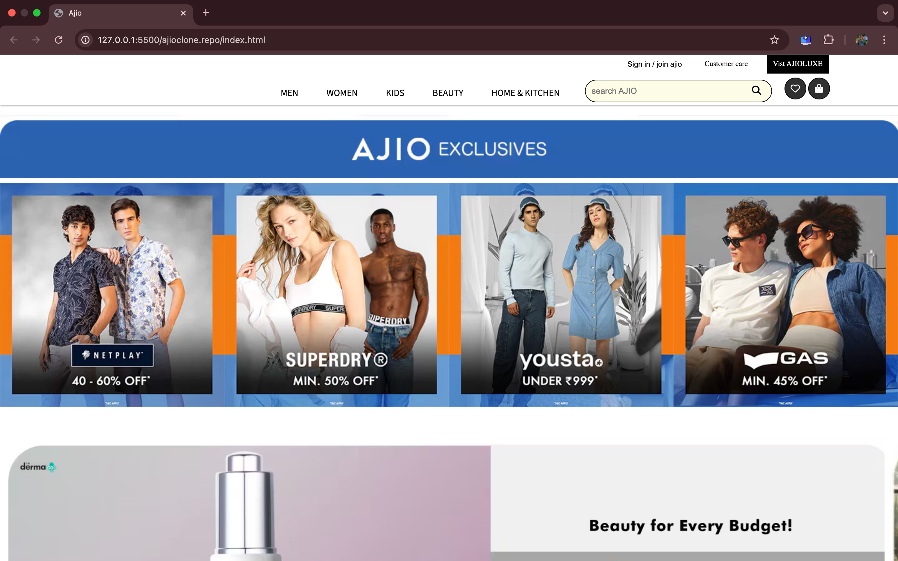

# Ajio Clone

This project is a **static clone** of the Ajio website, built using **HTML and CSS**. The purpose of this project is to practice front-end development skills, focusing on layout structuring and styling specifically for **desktop screens**.

## Features
- Desktop-only design
- HTML and CSS-based structure
- Proper alignment and styling similar to the original Ajio website

## Technologies Used
- **HTML**: Structure of the webpage
- **CSS**: Styling and layout adjustments

## Screenshots

## How to Run the Project
1. Download or clone the repository.
2. Open `index.html` in your desktop browser.
3. Ensure all assets (CSS and images) are properly linked.

## Future Enhancements
- Adding **JavaScript** for interactive elements.
- Improving **accessibility** and SEO.
- Enhancing **design with animations and transitions**.

## Author
**Manideep Sabbani**

For any queries, reach out via GitHub: [sabbanimanideep](https://github.com/sabbanimanideep)

